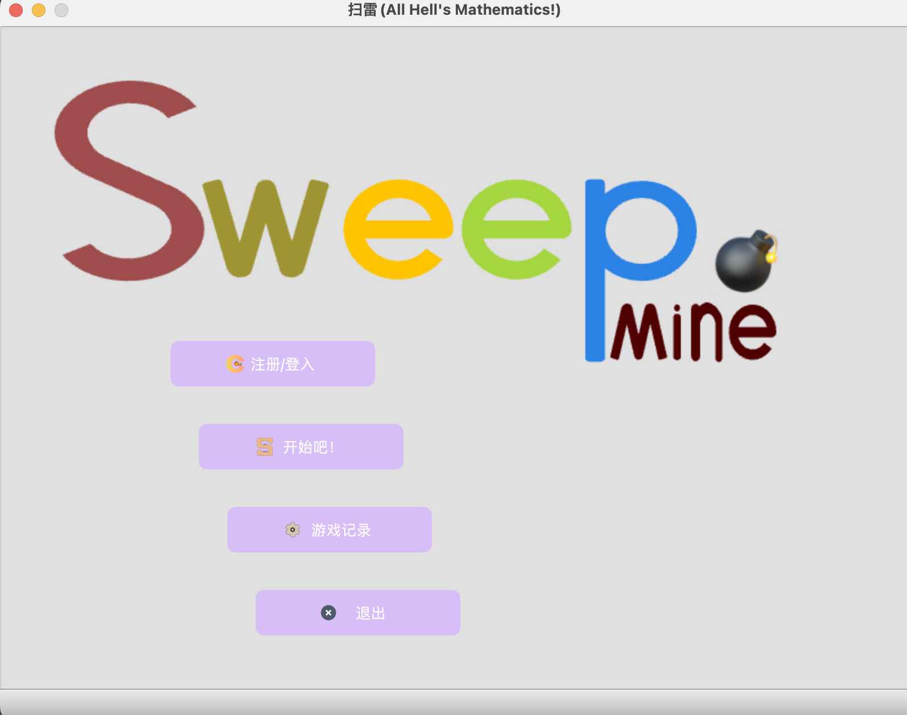
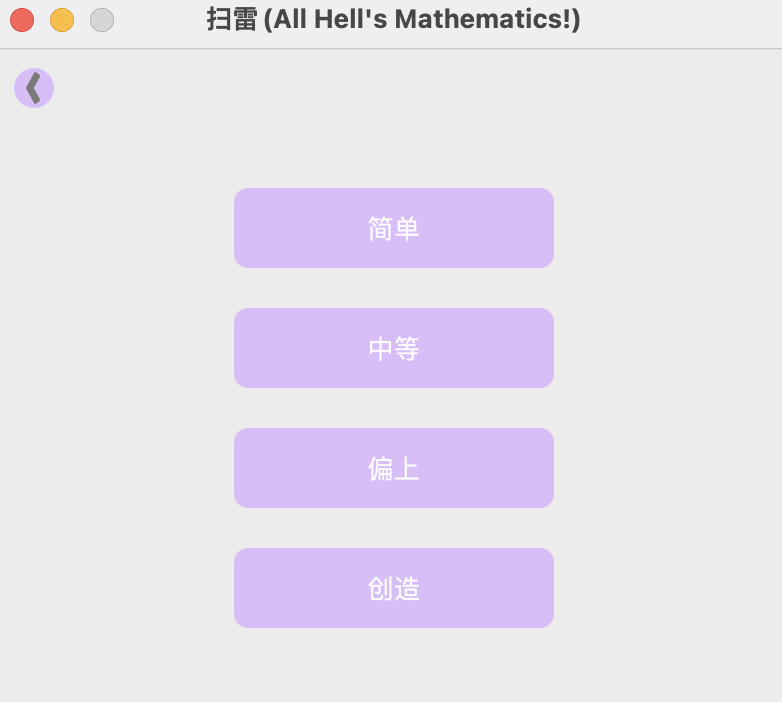
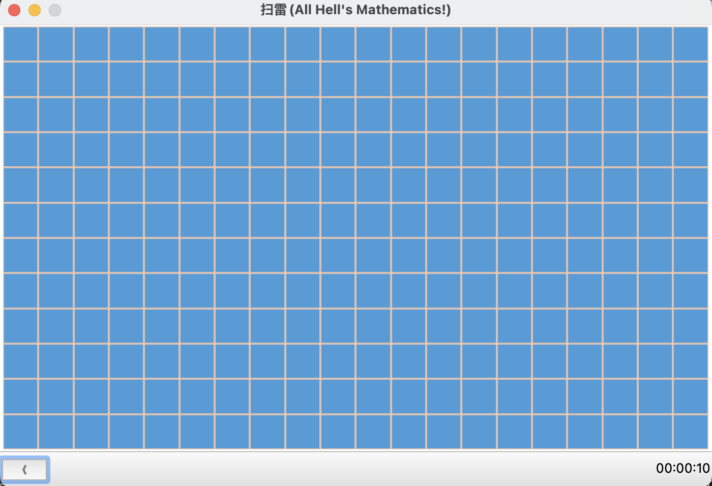
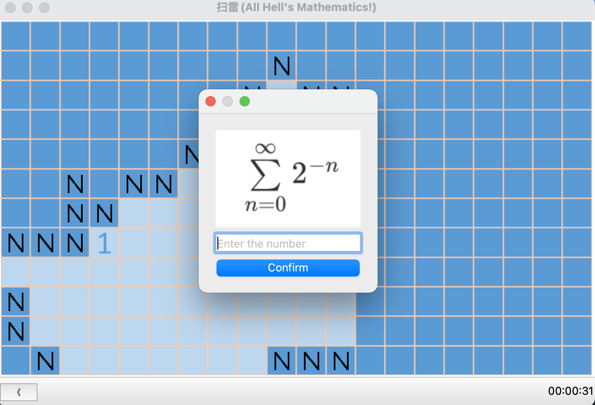

# Mines Cleaner
> 扫雷 （基于 C++/Qt）


### 食用指北🧭


#### 编译工具、库要求

- Qt5   : [Qt](https://www.qt.io/)
- QtSql : [Qt SQL](https://doc.qt.io/qt-6/qtsql-index.html)
- CMake : [下载](https://cmake.org/download/)
- Make  : [在windows上安装make](https://zhuanlan.zhihu.com/p/630244738)、[下载](https://www.gnu.org/software/make/)


#### 下载🦐

```bash
git clone https://github.com/Chenpeel/Mines_Cleaner.git
```

进入目录

```bash
cd Mines_Cleaner
```

创建build文件夹，进入build文件夹

```bash
mkdir build
cd build
```

使用cmake和make编译生成

```bash
cmake ..
make
```

运行（生成的可执行文件路径名可能不同，**仅以MacOS为例**）

```bash
./Mine_Sweeper.app/Contents/MacOS/Mine_Sweeper
```


### 简单展示

1. 进入游戏
   

2. 选择难度
   

3. 游戏界面
   
   
4. 扫除失败
